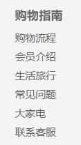
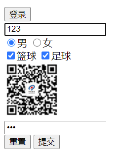
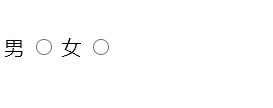

## 表格属性 table

---

### <font color=#56b981>\#</font> 单元格

- <strong>单元格与内容间距:</strong> <font color=#cd69a1>cellpadding</font>

- <strong>单元格之间距离:</strong> <font color=#cd69a1>cellspacing</font>

- <strong>合并单元格:</strong> <font color=#cd69a1>rowspan、colspan</font>

```html
<table border="8" cellpadding="10" cellspacing="20">
  <tr>
    <td colspan="2">1</td>
    <td rowspan="2">1</td>
  </tr>
  <tr>
    <td>2</td>
    <td>2</td>
  </tr>
</table>
```

## 列表属性

---

### <font color=#56b981>\#</font> ul、li

### <font color=#56b981>\#</font> ol、li

### <font color=#56b981>\#</font> dt、dd

```html
<dl>
  <dt>服务指南</dt>
  <dd><a href="#">购物流程</a></dd>
  <dd><a href="#">购物流程</a></dd>
  <dd><a href="#">购物流程</a></dd>
  <dd><a href="#">购物流程</a></dd>
  <dd><a href="#">购物流程</a></dd>
  <dd><a href="#">购物流程</a></dd>
</dl>
```



## 表单属性

---

### <font color=#56b981>\#</font> 表单域 form

- <strong>提交地址:</strong> <font color=#cd69a1>action</font>

- <strong>提交方式:</strong> <font color=#cd69a1>method</font>

- <strong>表单名称:</strong> <font color=#cd69a1>name</font>

### <font color=#56b981>\#</font> 下拉框 select

- <strong>选项:</strong> <font color=#cd69a1>option</font>

- <strong>默认选中:</strong> <font color=#cd69a1>selected</font>

```html
<select>
  <option selected="selected">1</option>
  <option>2</option>
</select>
```

### <font color=#56b981>\#</font> 文本域 textarea

- <strong>显示行数:</strong> <font color=#cd69a1>rows</font>

- <strong>每行字符数:</strong> <font color=#cd69a1>cols</font>

```html
<textarea cols="5" rows="10"></textarea>
```

### <font color=#56b981>\#</font> 输入 input

- <strong>按钮:</strong> <font color=#cd69a1>button</font>

- <strong>单选框:</strong> <font color=#cd69a1>radio</font>

- <strong>多选框:</strong> <font color=#cd69a1>checkbox</font>

- <strong>隐藏框:</strong> <font color=#cd69a1>hidden</font>

- <strong>图片:</strong> <font color=#cd69a1>image</font>

- <strong>密码框:</strong> <font color=#cd69a1>password</font>

- <strong>重置按钮:</strong> <font color=#cd69a1>reset</font>

- <strong>提交按钮:</strong> <font color=#cd69a1>submit</font>

- <strong>文本框:</strong> <font color=#cd69a1>text</font>

- <strong>...</strong>

| 属性名      | 描述                                            |
| ----------- | ----------------------------------------------- |
| name        | input 元素名 要求同组单选框、复选框 name 值相同 |
| value       | input 元素值                                    |
| checked     | 默认选中                                        |
| maxlength   | 最大长度                                        |
| placeholder | 提示水印文本                                    |

```html
<form action="xxx" method="get">
  <input type="button" value="登录" /><br />
  <input type="text" name="" id="" /><br />
  <input type="radio" name="1" id="" />男
  <input type="radio" name="1" id="" />女<br />
  <input type="checkbox" name="2" id="" />篮球
  <input type="checkbox" name="2" id="" />足球<br />
  <input type="hidden" name="" />
  <input type="image" src="../../Shop/images/wx_cz.jpg" alt="" /><br />
  <input type="password" name="" id="" /><br />
  <input type="reset" value="重置" />
  <input type="submit" value="提交" />
</form>
```



### <font color=#56b981>\#</font> 标签 label

> 用于绑定表单元素，当点击 label 标签内文本时，浏览器会自动将焦点转到对应表单元素上

```html
<label for="boy">男</label> <input type="radio" name="sex" id="boy" />
<label for="gril">女</label> <input type="radio" name="sex" id="gril" />
```



## 其他标签

---

### <font color=#56b981>\#</font> 特殊字符

| 字符 | 标签      |
| ---- | --------- |
| 空格 | \&nbsp;   |
| <    | \&lt;     |
| >    | \&gt;     |
| &    | \&amp;    |
| ￥   | \&yen;    |
| ©    | \&copy;   |
| ®    | \&reg;    |
| °    | \&deg;    |
| ±    | \&plusmn; |
| ×    | \&times;  |
| ÷    | \&divide; |
| ²    | \&sup2;   |
| ³    | \&sup3;   |

### <font color=#56b981>\#</font> 文本格式化标签

| 作用   | 标签      |
| ------ | --------- |
| 粗体   | string、b |
| 斜体   | em、i     |
| 下划线 | ins、u    |
| 删除线 | del、s    |
